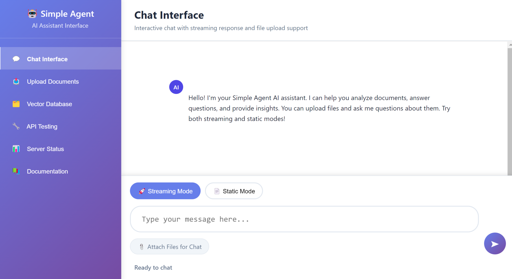
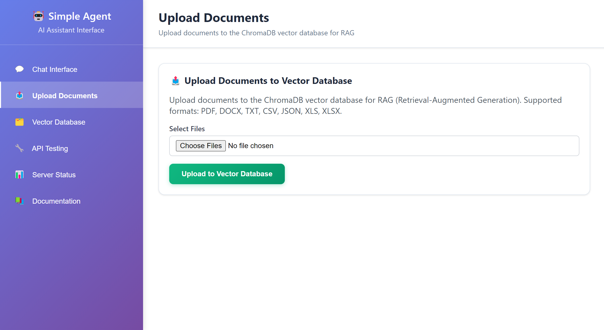
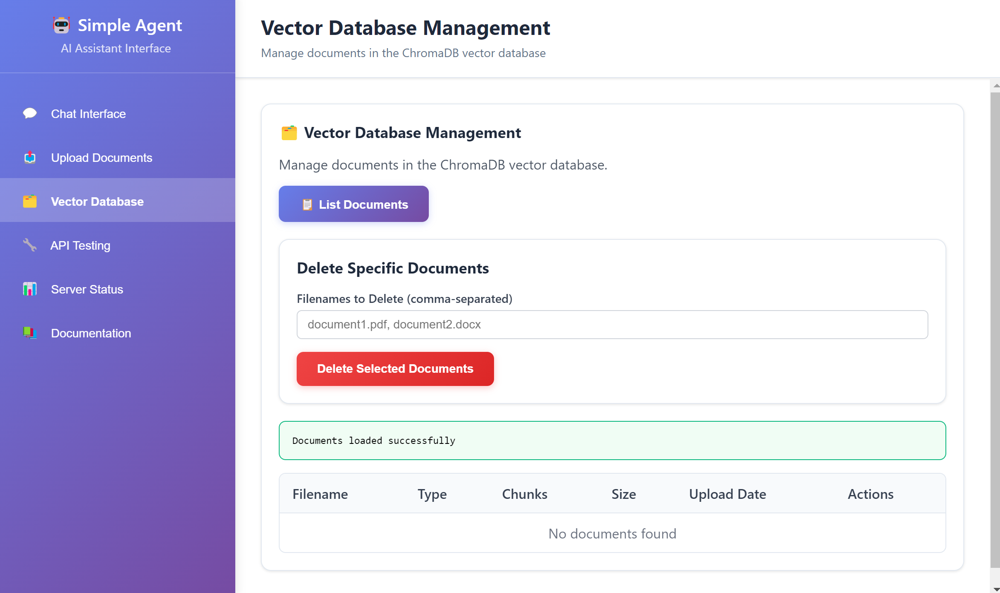

# Simple Agent

A powerful AI agent framework with document processing, vector storage, and intelligent conversation capabilities. Built with Flask, ChromaDB, and support for multiple LLM providers.

## 📸 Interface Preview

### Chat Interface

*Interactive chat interface with streaming responses and file upload capabilities*

### Document Upload

*Easy document upload interface supporting multiple file formats*

### Vector Database Management

*Comprehensive vector database management with document listing and deletion*

## ✨ Features

- **Multi-format Document Processing**: PDF, DOCX, Excel, CSV, TXT, Markdown, HTML
- **Vector Database Integration**: ChromaDB with embedding support (Qwen, OpenAI)
- **Intelligent Chunking**: Automatic document splitting with metadata preservation
- **User & Session Tracking**: Track document ownership and conversation sessions
- **Built-in Tools**: Document retrieval, data analysis, web search, and more
- **Multiple LLM Support**: Qwen, DeepSeek, OpenAI integration
- **RESTful API**: Complete web interface with Swagger documentation
- **Batch Processing**: Handle multiple documents efficiently

## 🚀 Quick Start

### Installation

1. **Clone the repository**
   ```bash
   git clone <repository-url>
   cd simple-agent
   ```

2. **Install dependencies**
   ```bash
   pip install -r requirements.txt
   ```

3. **Configure API keys**
   
   Create a `config.ini` file in the root directory:
   ```ini
   [embedding]
   provider = qwen
   api_key = your_qwen_api_key
   base_url = 
   model = text-embedding-v2

   [llm]
   provider = qwen
   api_key = your_qwen_api_key
   base_url = 
   model = qwen-plus

   [deepseek]
   api_key = your_deepseek_api_key
   base_url = https://api.deepseek.com
   model = deepseek-chat

   [openai]
   api_key = your_openai_api_key
   base_url = https://api.openai.com/v1
   model = gpt-4
   ```

   Alternatively, set environment variables:
   ```bash
   export QWEN_API_KEY=your_qwen_api_key
   export DEEPSEEK_API_KEY=your_deepseek_api_key
   export OPENAI_API_KEY=your_openai_api_key
   ```

4. **Run the application**
   ```bash
   python main.py
   ```

   The application will start on `http://localhost:5000`

## 📖 Usage Examples

### Document Processing

```python
# Process a single document
result = store_document("data/report.pdf", user_id="user123")
print(f"Stored {result['chunks_stored']} chunks")

# Process multiple documents in batch
vector_store = VectorStoreService()
files = ["data/report.pdf", "data/analysis.xlsx", "data/summary.txt"]
result = vector_store.batch_process_files(files, user_id="user123", session_id="session456")
print(f"Processed {result['total_files']} files, {result['successful']} successful")

# Process without chunking (for small files)
result = store_document("data/summary.txt", chunk_documents=False, user_id="user123")

# Track documents by session
result = store_document("data/quarterly_report.pdf", 
                       user_id="user123", 
                       session_id="q4_analysis")
```

### Document Management

```python
# Delete a document
result = delete_document("report.pdf")
print(f"Deleted {result['documents_deleted']} chunks")

# Get database information
info = get_document_info()
print(f"Total documents: {info['total_documents']}")
print(f"Unique files: {info['unique_files']}")

# List all stored files
files = list_stored_files()
print(f"Stored files: {files}")
```

### Agent Conversation

```python
# Initialize agent
agent = AgentService()

# Start conversation with document context
response = agent.chat(
    message="What are the key findings in the quarterly report?",
    user_id="user123",
    session_id="q4_analysis"
)
print(response['response'])
```

## 🛠️ Built-in Tools

Simple Agent comes with powerful built-in tools:

| Tool                | Function                        | Example Use Case                      |
|---------------------|---------------------------------|---------------------------------------|
| **Document Retriever** | Search policy/business docs      | "Find the section on export rules"    |
| **Data Analyzer**      | Analyze business/project data    | "What's the average project duration?"|
| **Web Search**         | Real-time information lookup     | "Latest news on AI regulations"       |
| **PostgreSQL Tool**    | Database queries and analysis    | "Show sales data for Q4"             |

## 🔧 API Endpoints

Access the interactive API documentation at `http://localhost:5000/api/docs`

### Key Endpoints

- `POST /api/vector/upload` - Upload documents to vector database
- `POST /api/agent/chat` - Chat with the AI agent
- `GET /api/vector/documents` - List stored documents
- `DELETE /api/vector/documents/{filename}` - Delete documents

## 🏗️ Architecture

```
simple-agent/
├── app/
│   ├── service/
│   │   ├── agent/          # AI agent and conversation logic
│   │   ├── document/       # Document processing and chunking
│   │   ├── embedding/      # Embedding generation services
│   │   ├── llm/           # LLM provider integrations
│   │   └── vector/        # Vector database operations
│   ├── tools/             # Built-in agent tools
│   ├── utils/             # Utility functions
│   └── web/              # Flask web application
├── config.ini            # Configuration file
├── main.py              # Application entry point
└── requirements.txt     # Python dependencies
```

## 🔧 Configuration

The application supports multiple configuration methods:

1. **config.ini file** (recommended)
2. **Environment variables** (for deployment)
3. **Default values** (for development)

### Supported Providers

- **Embedding**: Qwen, OpenAI
- **LLM**: Qwen, DeepSeek, OpenAI
- **Vector Database**: ChromaDB
- **Database**: PostgreSQL (optional)

## 🤝 Contributing

1. Fork the repository
2. Create a feature branch (`git checkout -b feature/amazing-feature`)
3. Commit your changes (`git commit -m 'Add amazing feature'`)
4. Push to the branch (`git push origin feature/amazing-feature`)
5. Open a Pull Request

## 📄 License

This project is licensed under the MIT License - see the LICENSE file for details.

## 🆘 Support

For questions and support:
- Create an issue on GitHub
- Check the API documentation at `/api/docs`
- Review the configuration examples above

---

**Simple Agent** - Making AI document processing simple and powerful.


### 🧠 Core Architecture

```
┌────────────────────────────────────────────────────────────────────────┐
│                           Chat Interface Layer                         │
│                   (chat_interface.py, chatbot.py)                      │
├────────────────────────────────────────────────────────────────────────┤
│                        ReAct Agent Orchestration Layer                 │
│                          (agent.py)                                    │
│  ┌─────────────────┐  ┌─────────────────┐  ┌─────────────────┐         │
│  │   Reasoning     │  │   Acting        │  │   Memory Mgmt   │         │
│  │  (Reasoning)    │  │   (Acting)      │  │  (memory.py)    │         │
│  └─────────────────┘  └─────────────────┘  └─────────────────┘         │
├────────────────────────────────────────────────────────────────────────┤
│                            Tool Execution Layer                        │
│  ┌─────────────────┐  ┌──────────────────────┐  ┌─────────────────────┐│
│  │   RAG Retriever │  │   Pandas Analyzer    │  │     PostgreSQL      ││
│  │(Semantic Search)│  │(excel analysis agent)│  │ (postgresql agent)  ││
│  └─────────────────┘  └──────────────────────┘  └─────────────────────┘│
│  ┌─────────────────────┐  ┌─────────────────┐                          │
│  │  Multimodal Analyzer│  │  Contextualizer │                          │
│  │(contextual analyzer)│  │ (semantic boost)│                          │
│  └─────────────────────┘  └─────────────────┘                          │
├────────────────────────────────────────────────────────────────────────┤
│                          AI Service Layer                              │
│  ┌─────────────────┐  ┌─────────────────┐  ┌─────────────────┐         │
│  │   LLM Service   │  │   Embedding     │  │  Vector DB      │         │
│  │ (DeepSeek/Qwen) │  │ (text-embedding)│  │  (ChromaDB)     │         │
│  └─────────────────┘  └─────────────────┘  └─────────────────┘         │
└────────────────────────────────────────────────────────────────────────┘
```

### 🎯 ReAct Agent Orchestration

**ReAct Agent** is the core orchestrator, enabling intelligent task decomposition and tool selection:

- **Reasoning**: Analyzes user intent and task complexity
- **Acting**: Selects and executes the best tool combination
- **Observation**: Evaluates results and determines next steps
- **Iteration**: Continuously improves strategies based on feedback

### 🛠️ Professional Tool Integration

#### 1. **RAG Retrieval System**
- **Hybrid Search**: ChromaDB vector + BM25 keyword search
- **Smart Chunking**: Adaptive document splitting for semantic integrity
- **Multi-format Support**: PDF, Word, Excel, Markdown, etc.
- **Semantic Understanding**: Deep matching with text-embedding-v4

#### 2. **Pandas Data Analysis Agent**
- **Natural Language Query**: Converts questions into Pandas operations
- **Safe Execution**: Runs analysis in a sandboxed environment
- **Smart Reasoning**: Auto-generates analysis strategies
- **Visualization**: Auto-generates charts and reports

#### 3. **PostgreSQL Database Agent**
- **Auto SQL Generation**: Natural language to SQL
- **Schema Exploration**: Analyzes database structure
- **Secure Connection**: Connection pooling and SQL injection protection
- **Performance Optimization**: Query tuning and result caching

#### 4. **Multimodal Context Analyzer**
- **Deep Semantic Analysis**: Understands document structure and context
- **Cross-modal Understanding**: Integrates text, tables, images
- **Context Boost**: Enhances local understanding with global info
- **Smart Summarization**: Extracts key points and summaries

### 🔄 System Workflow

1. **User Input** → Chat interface receives natural language requests
2. **Intent Recognition** → ReAct Agent analyzes task type and complexity
3. **Tool Selection** → Chooses the best tool(s) for the job
4. **Parallel Execution** → Tools collaborate to handle complex tasks
5. **Result Integration** → Aggregates outputs for unified answers
6. **Memory Update** → Saves context for continuous interaction

### 💡 Technical Highlights

- **Smart Orchestration**: ReAct pattern for complex task automation
- **Tool Collaboration**: Seamless integration of multiple tools
- **Context Awareness**: Global memory for coherent conversations
- **Secure Execution**: Sandbox environment for safe code
- **High Performance**: Vector search + caching for fast responses
- **Extensible**: Modular design for easy tool/function expansion

## 🚀 Roadmap

**Planned Features:**
- 🌐 Web-based interface for easy uploads
- 📊 Advanced data visualization and charts
- 🔄 Real-time collaborative analysis
- 🌍 Multi-language document support
- 🐳 Docker containerization for deployment
- 🔌 REST API for integration